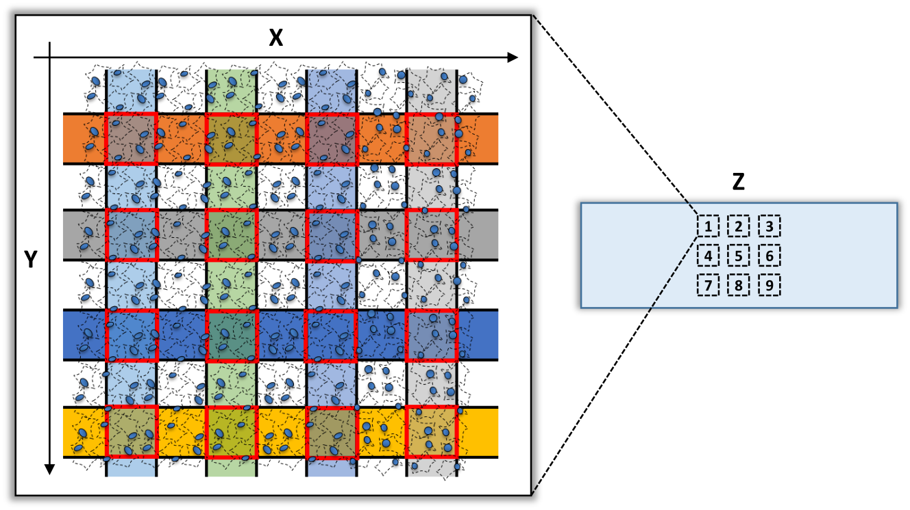

# xDbit_toolbox

This repository contains all code that is necessary to reproduce results shown in the preprint https://www.biorxiv.org/content/10.1101/2022.08.30.505834v1.

Further, it includes an analysis pipeline to compute the digital gene expression matrix from Dbit-seq or xDbit experiments.
This part is partially based on the Split-seq toolbox: https://github.com/RebekkaWegmann/splitseq_toolbox.

If you have questions or suggestions, please feel free to open an issue or contact me directly.

## Contents

1. [Introduction](#introduction)

2. [Get started](#get-started)

3. [Preprint](#preprint)

All Jupyter notebooks of the analyses performed in the publication can be found [here](./publication/notebooks/).

# Introduction
## Barcoding layout

xDbit allows the spatial barcoding (X, Y) of 9 tissue sections (Z) on one object slide.



## Read structure


## xDbit toolbox preprocessing pipeline


The preprocessing pipeline of the xDbit toolbox consists of two steps to convert raw sequencing reads into a spot/gene count matrix with aligned images:

1. [**ReadsToCounts**](./ReadsToCounts/)
2. [**CountsToAnndata**](./CountsToAnndata/)

Both pipelines and more detailed instructions can be found in the linked folders.

# Get started

## Requirements

Installed [Anaconda](https://docs.anaconda.com/anaconda/install/) or Miniconda Python distribution.

Further, the pipeline uses a bash script, custom Python scripts, and many tools from the [Drop-seq toolbox](https://github.com/broadinstitute/Drop-seq/releases) (Mc Caroll lab, Harvard Medical school) as well as [Picard](https://broadinstitute.github.io/picard/) (Broad institute), which are all included in this toolbox. It was created in a Linux server environment and the [STAR](https://github.com/alexdobin/STAR) alignment step requires more than 30 GB RAM.
## Installation

### Clone repository

```
git clone https://github.com/jwrth/xDbit_toolbox.git

# make drop seq toolbox executable
cd /path/to/repo/xDbit_toolbox
chmod u=rwx,g=r,o=r ./ReadsToCounts/external_tools/Drop-seq_tools-2.1.0/*
```

### Install python environment

```
# install environment from file
conda env create -f environment_xdbit.yml python=3

# activate environment
conda activate xdbit

# to access parts of the pipeline in a Jupyter notebook install a kernel for this environment
conda install -c anaconda ipykernel
python3 -m ipykernel install --user --name=xdbit_kernel
```

## Use toolbox as python module

To load the `xDbit_toolbox` as module run following code.

```
## Import the custom library
import os
import sys

# add xDbit toolbox path to path variable
module_path = os.path.abspath("../../")
if module_path not in sys.path:
    sys.path.append(module_path)

import xdbit_funcs as db
```
# Preprint

## Spatial Transcriptomics Using Multiplexed Deterministic Barcoding in Tissue

Preprint available on [BioRxiv](https://www.biorxiv.org/content/10.1101/2022.08.30.505834v1).

## Abstract

In this study, we present a multiplexed version of deterministic barcoding in tissue (xDbit) to acquire spatially resolved transcriptomes of nine tissue sections in parallel. New microfluidic chips were developed to spatially encode mRNAs over a total tissue area of 1.17 cm2 with spots of 50 µm×50 µm. Optimization of the biochemical protocol increased read and gene counts per spot by one order of magnitude compared with previous reports. Furthermore, the introduction of alignment markers allows seamless registration of images and spatial transcriptomic spot coordinates. Together with technological advances, we provide an open-source computational pipeline to transform raw sequencing data from xDbit experiments into the AnnData format. The functionality of xDbit was demonstrated by the acquisition of 18 spatially resolved transcriptomic datasets from five different murine organs, including cerebellum, liver, kidney, spleen, and heart. Factor analysis and deconvolution of xDbit spatial transcriptomes allowed for in-depth characterization of the murine kidney.
